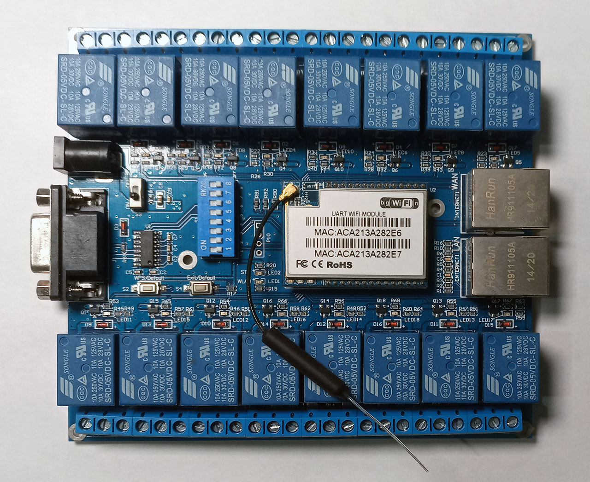

This is a fork of [hlk_sw16](https://github.com/home-assistant/core/tree/dev/homeassistant/components/hlk_sw16) and [protocol](https://github.com/jameshilliard/hlk-sw16), created by me to support the early version of [Hi-Link](http://www.hlktech.net/) [HLK-SW16](http://www.hlktech.net/product_detail.php?ProId=48) without RTC clock.
The relay control protocol is little bit different.
The core component documentation is [here](https://www.home-assistant.io/integrations/hlk_sw16/)

Thanks to @jameshilliard for the initial code.

## Install

Download hlk_sw16_old-master.zip, extract and copy the entire folder `hlk_sw16_old-master` folder to `custom_components` in your `config` folder.

## Bonus

[hlk_sw16_cmd.java](/hlk_sw16_cmd.java) is a simple command line tool to demostrate the protocol.
